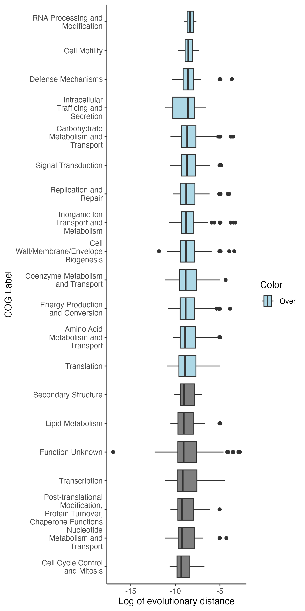

# LOggBe
Evolutionary analysis of bacterial core genes

## Installation
Create package and install dependencies 

```sh
git clone [to be finished]
```

## Use
logbee /path/to/alignment_directory /path/to/output_directory --jobs 10

## Output 
Output is a filtered alignment, phylogenetic tree and finally a summarized text file called rates.txt which has the relative rate of each core gene. 

This data can be combined with gene annotation data to make conclusions about which types of genes are evolving slower or faster 

